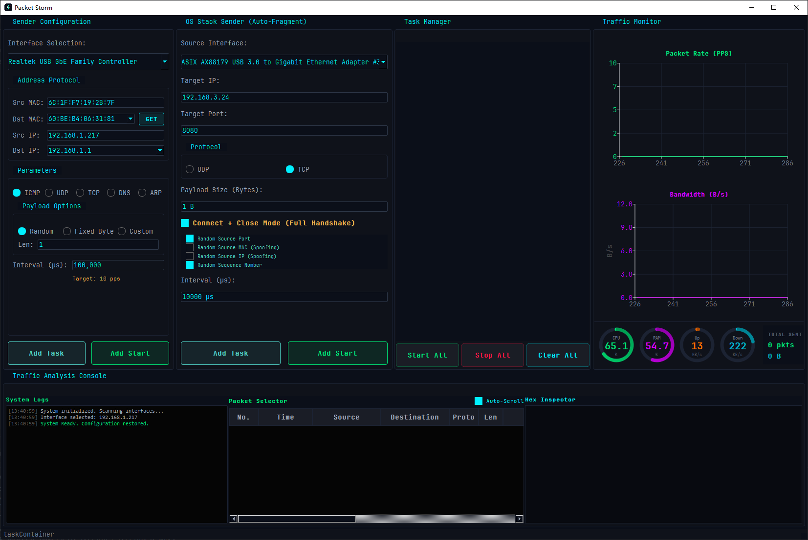

# PacketStorm Sender - 高性能网络数据包生成器

   

**项目地址**: [https://github.com/jintianwenwenzaoshuilema/PacketStorm-Sender](https://github.com/jintianwenwenzaoshuilema/PacketStorm-Sender)

**PacketStorm Sender** 是一个基于 **Qt 6** 和 **WinPcap/Npcap** 开发的高性能网络数据包生成工具。专为网络调试、压力测试、协议栈验证和网络性能评估而设计，支持自定义构造多种协议的数据包，并提供微秒级的发送间隔控制。

> **⚠️ 重要提示**: 本项目仅供学习、网络调试和合法测试使用。使用者应遵守当地法律法规，不得用于任何非法用途。对于因使用本软件造成的任何直接或间接损失，开发者不承担任何责任。

---

## 📸 界面预览



*PacketStorm Sender 主界面 - 深色主题，实时统计和图表展示*

---

## ✨ 主要功能

### 📦 多协议支持
- **UDP**: 自定义源/目的端口、载荷长度和内容
- **TCP**: 支持自定义 Flags (SYN, ACK, PSH, FIN, RST)，支持 **SYN Flood** 增强模式
- **ICMP**: 发送 Echo Request (Ping) 数据包，支持自定义载荷
- **DNS**: 支持自定义查询域名，可进行 DNS 查询测试
- **ARP**: 支持 ARP 请求/应答包的构造和发送

### 🎯 双模式发送
- **原始包模式 (Raw Packet Mode)**: 基于 WinPcap/Npcap，可完全自定义数据包结构，包括 MAC 地址、IP 地址等所有字段
- **Socket 模式 (Socket Mode)**: 基于系统 Socket API，支持 TCP/UDP 连接，适用于应用层测试

### ⚡ 高性能与随机化
- **微秒级精度**: 支持微秒 (µs) 级发送间隔设置，可实现精确的流量控制
- **任务管理器 (Task Manager)**: 
  - **多任务并发**: 支持同时运行多个不同的发包任务
  - **独立控制**: 每个任务可独立启动、停止和移除
  - **实时监控**: 任务卡片实时显示单个任务的发送速率 (PPS)
  - **全局控制**: 支持“全部开始”、“全部停止”和“一键清空”
- **高级随机化 (SYN Flood)**: 
  - **随机源端口**: 1024-65535 随机切换
  - **随机源 IP**: 基于子网掩码 (/24) 自动生成合法随机 IP
  - **随机源 MAC**: 符合 IEEE 802 标准的随机 MAC 地址生成
  - **随机序列号**: 每个数据包使用独立的 32 位随机序列号
- **批量发送优化**: 采用批量发送队列策略，在高吞吐量下保持 UI 流畅响应
- **实时统计**: 实时显示发送包数、总字节数、发送速率 (pps) 和带宽 (B/s)
- **性能图表**: 实时绘制 PPS (Packets Per Second) 和带宽 (Mbps) 趋势图

### 🎨 现代化界面
- **深色主题**: 基于 Qt Fusion 风格的现代化深色界面
- **实时监控**: 状态栏实时显示发送统计信息
- **数据包查看**: 十六进制格式查看发送的数据包内容
- **协议解析**: 自动解析并显示数据包的协议信息（源/目的地址、协议类型等）
- **历史记录**: 自动保存常用目标 IP 地址

### 🔧 高级配置
- **载荷模式**: 支持随机、固定字节值、自定义数据三种载荷填充模式
- **网卡选择**: 自动枚举并支持选择系统中的网络适配器
- **MAC 地址获取**: 支持通过 ARP 查询获取目标 MAC 地址
- **配置保存**: 自动保存和恢复界面配置

---

## 🛠️ 构建依赖

### 必需组件

1. **Qt 开发环境**
   - Qt 6.8.3 或更高版本
   - 编译器: MSVC 2019+ 或 MinGW 64-bit
   - 模块: Core, Gui, Widgets, Network, Charts

2. **WinPcap/Npcap SDK**
   - 本项目使用 **WpdPack** (WinPcap Developer's Pack)
   - 下载地址: [WinPcap Developer's Pack](https://www.winpcap.org/devel.htm)
   - 或使用 Npcap SDK: [Npcap SDK](https://npcap.com/#download)
   - 解压后路径示例: `C:\WpdPack\`

3. **运行环境**
   - Windows 10/11 (64-bit)
   - 必须安装 [Npcap](https://npcap.com/#download) 或 [WinPcap](https://www.winpcap.org/)
   - **重要**: 安装 Npcap 时必须勾选 **"Install Npcap in WinPcap API-compatible Mode"**

---

## 🚀 编译指南

### 1. 准备环境

```bash
# 克隆仓库
git clone https://github.com/jintianwenwenzaoshuilema/PacketStorm-Sender.git
cd PacketStorm-Sender
```

### 2. 配置 WinPcap/Npcap SDK

1. 下载并解压 WpdPack 或 Npcap SDK 到本地目录（例如 `C:\WpdPack\`）

2. 打开 `PacketStorm_Sender.pro` 文件，检查并修改以下路径：

```qmake
# 根据您的实际安装路径修改
INCLUDEPATH += "C:\WpdPack\Include"
LIBS += "-LC:\WpdPack\Lib\x64" -lwpcap -lws2_32 -liphlpapi
```

### 3. 构建项目

**使用 Qt Creator:**
1. 打开 Qt Creator
2. 打开 `PacketStorm_Sender.pro` 文件
3. 选择 Release 模式
4. 点击 **构建 (Build)** 按钮

**使用命令行 (MinGW):**
```bash
qmake PacketStorm_Sender.pro
mingw32-make release
```

**使用命令行 (MSVC):**
```bash
qmake PacketStorm_Sender.pro
nmake release
```

### 4. 运行

编译完成后，可执行文件位于 `release/` 目录下。确保系统已安装 Npcap 或 WinPcap 运行时。

---

## 📖 使用说明

详细功能说明文档：
- [任务管理器 (Task Manager) 说明](TASK_MANAGER_功能说明.md)
- [SYN Flood 增强功能说明](SYN_FLOOD_增强功能说明.md)
- [SYN Flood 选项详细说明](SYN_FLOOD_选项说明.md)
- [编译指南](编译说明_SYN_FLOOD.md)

### 原始包模式 (Raw Packet Mode)

1. **选择网卡**: 在 "Interface Selection" 下拉框中选择用于发包的网络适配器

2. **配置地址信息**:
   - **源 MAC 地址**: 发送数据包的源 MAC 地址（格式: `AA:BB:CC:DD:EE:FF`）
   - **目标 MAC 地址**: 接收数据包的目标 MAC 地址
   - **源 IP 地址**: 发送数据包的源 IP 地址（格式: `192.168.1.100`）
   - **目标 IP 地址**: 接收数据包的目标 IP 地址
   - 点击 **"Get MAC"** 按钮可通过 ARP 查询获取目标 MAC 地址

3. **选择协议类型**:
   - **UDP**: 设置源端口、目标端口和载荷长度
   - **TCP**: 设置源端口、目标端口、TCP Flags 和载荷长度
   - **ICMP**: 设置载荷长度（默认 32 字节）
   - **DNS**: 输入查询域名（如 `www.google.com`）
   - **ARP**: 自动构造 ARP 请求包

4. **配置载荷**:
   - **随机模式**: 使用随机字节填充
   - **固定模式**: 使用指定字节值填充
   - **自定义模式**: 输入自定义的十六进制数据

5. **设置发送参数**:
   - **Interval (µs)**: 设置发包间隔（例如 `1000` = 1ms，`0` = 全速发送）
   - **Payload Length**: 数据包载荷长度（字节）

6. **开始发送**: 点击 **"START SENDING"** 按钮开始发送

7. **监控数据**:
   - 状态栏实时显示发送统计
   - 图表窗口显示 PPS 和带宽趋势
   - 数据包表格显示发送的数据包详情和十六进制内容

### 🔥 SYN Flood 模式 (高级)

1. **选择 TCP 协议**: 在协议选择区域点击 **TCP**。

2. **启用 SYN Flood**: 勾选 **"SYN Flood"** 复选框。

3. **配置随机化选项**:
   - **随机端口**: 勾选后每个包使用不同源端口。
   - **随机 MAC**: 勾选后每个包使用符合规范的随机源 MAC。
   - **随机 IP**: 勾选后在源 IP 所在的 /24 子网内随机生成源 IP。

4. **注意事项**:
   - 随机 IP 和 MAC 会显著增加网络设备负担，请在授权环境中使用。
   - 启用随机 IP 前请确保已在 "Source IP" 框中输入正确的参考 IP。

### Socket 模式 (Socket Mode)

1. **配置目标信息**:
   - **Target IP**: 目标 IP 地址
   - **Target Port**: 目标端口号
   - **Source IP**: 源 IP 地址（可选，留空使用系统默认）

2. **选择协议**:
   - 勾选 **UDP** 或 **TCP** 协议

3. **设置参数**:
   - **Payload Length**: 发送的数据长度
   - **Interval (µs)**: 发送间隔

4. **开始发送**: 点击 **"START SOCKET SEND"** 按钮

5. **查看日志**: Socket 模式会在日志窗口显示连接状态和错误信息

### 🛠️ 任务管理器 (Task Manager)

1. **添加任务**: 无论是原始包模式还是 Socket 模式，点击开始发送按钮后，任务都会被添加到右侧的任务列表中。

2. **多任务并行**: 您可以重复配置参数并点击开始，创建多个并行的发包任务。

3. **单个控制**: 使用任务卡片上的 **Start/Stop** 切换状态，点击 **🗑️** 删除任务。

4. **全局控制**: 
   - **Start All**: 启动列表中所有任务。
   - **Stop All**: 停止所有正在运行的任务。
   - **Clear All**: 停止并清空所有任务。

---

## 📂 项目结构

```
PacketStorm_Sender/
├── main.cpp                 # 程序入口，字体加载和窗口初始化
├── sender_core.h/cpp        # 核心发包逻辑
│   ├── 协议头构造 (Ethernet, IP, UDP, TCP, ICMP, DNS, ARP)
│   ├── WinPcap 原始包发送实现
│   ├── Socket 发送实现
│   └── 批量发送队列优化
├── sender_window.h/cpp      # Qt GUI 主窗口
│   ├── 界面逻辑和事件处理
│   ├── 参数验证和配置管理
│   ├── 实时统计更新
│   ├── 图表绘制 (PPS/Bandwidth)
│   └── 数据包表格和十六进制查看
├── sender.ui                # Qt Designer 界面布局文件
├── hex_delegate.h           # 十六进制数据显示代理
├── PacketStorm_Sender.pro   # Qt 项目配置文件
├── resources.qrc             # Qt 资源文件（字体等）
├── .clang-format            # 代码格式化配置
├── .clangd                   # Clangd 语言服务器配置
└── README.md                 # 项目说明文档
```

### 核心模块说明

- **sender_core**: 底层网络操作，包括数据包构造、WinPcap 发送队列管理、Socket 连接管理等
- **sender_window**: 用户界面层，负责参数收集、线程管理、实时数据更新和可视化
- **hex_delegate**: 自定义表格代理，用于以十六进制格式显示数据包内容

---

## 🎯 使用场景

### 网络调试
- 测试网络设备的转发性能
- 验证防火墙规则配置
- 调试网络协议栈实现

### 性能测试
- 网络带宽压力测试
- 网络设备吞吐量评估
- 延迟和丢包率测试

### 协议验证
- TCP/IP 协议栈功能验证
- 自定义协议实现测试
- 网络协议兼容性测试

### 安全测试
- DDoS 攻击模拟（仅限授权环境）
- 网络设备安全策略验证
- 入侵检测系统 (IDS) 测试

---

## ⚙️ 技术特性

### 性能优化
- **批量发送队列**: 使用 `pcap_sendqueue_alloc` 和 `pcap_sendqueue_transmit` 实现批量发送，减少系统调用开销
- **多线程架构**: 发送操作在独立线程中执行，保证 UI 响应流畅
- **原子操作**: 使用 `std::atomic` 实现线程安全的统计计数

### 协议实现
- **完整协议栈**: 从以太网帧到应用层协议的完整实现
- **校验和计算**: 自动计算 IP、TCP、UDP、ICMP 校验和
- **字节序处理**: 正确处理网络字节序和主机字节序转换
- **字段随机化**: 实现基于子网的 IP 随机算法和符合 IEEE 标准的 MAC 随机算法

### 用户体验
- **实时反馈**: 毫秒级统计更新，实时图表绘制
- **数据可视化**: 双图表显示 PPS 和带宽趋势
- **数据包查看**: 十六进制格式查看，支持协议解析

---

## 🔍 常见问题

### Q: 程序无法找到网卡？
**A**: 确保已正确安装 Npcap 或 WinPcap，并且以管理员权限运行程序。

### Q: 发送失败或速度很慢？
**A**: 
- 检查目标 MAC 地址是否正确
- 确认网卡选择正确
- 检查防火墙设置
- 尝试降低发送速率

### Q: Socket 模式连接失败？
**A**:
- 检查目标 IP 和端口是否正确
- 确认目标服务是否运行
- 检查防火墙和路由配置
- 查看日志窗口的错误信息

### Q: 如何获取目标 MAC 地址？
**A**: 在原始包模式下，点击 **"Get MAC"** 按钮，程序会发送 ARP 请求查询目标 MAC 地址。

---

## 📝 开发说明

### 代码规范
- 使用 C++20 标准
- 遵循 `.clang-format` 配置的代码风格
- 行长度限制: 120 字符

### 编译选项
- C++ 标准: C++20
- Qt 模块: Core, Gui, Widgets, Network, Charts
- Windows 定义: `WIN32`, `WPCAP`, `HAVE_REMOTE`

### 依赖库
- **WinPcap/Npcap**: 原始数据包发送
- **Qt 6**: GUI 框架和网络功能
- **Windows Socket API**: Socket 模式支持

---

## 👤 作者

GitHub: [jintianwenwenzaoshuilema/PacketStorm-Sender](https://github.com/jintianwenwenzaoshuilema/PacketStorm-Sender)

---

## 🙏 致谢

- [WinPcap](https://www.winpcap.org/) - 原始数据包捕获库
- [Npcap](https://npcap.com/) - WinPcap 的现代化替代品
- [Qt](https://www.qt.io/) - 跨平台 GUI 框架
- [JetBrains Mono](https://www.jetbrains.com/lp/mono/) - 代码字体

---

## ⚠️ 免责声明

本软件仅用于网络测试、性能评估和教育目的。使用者应：

1. 遵守当地法律法规
2. 仅在授权环境中使用
3. 不得用于任何非法或恶意目的
4. 对使用本软件造成的任何后果自行承担责任

开发者不对因使用本软件造成的任何直接或间接损失（包括但不限于网络瘫痪、服务中断、数据丢失）承担任何责任。

---

**请负责任地使用本工具！** 🚀
